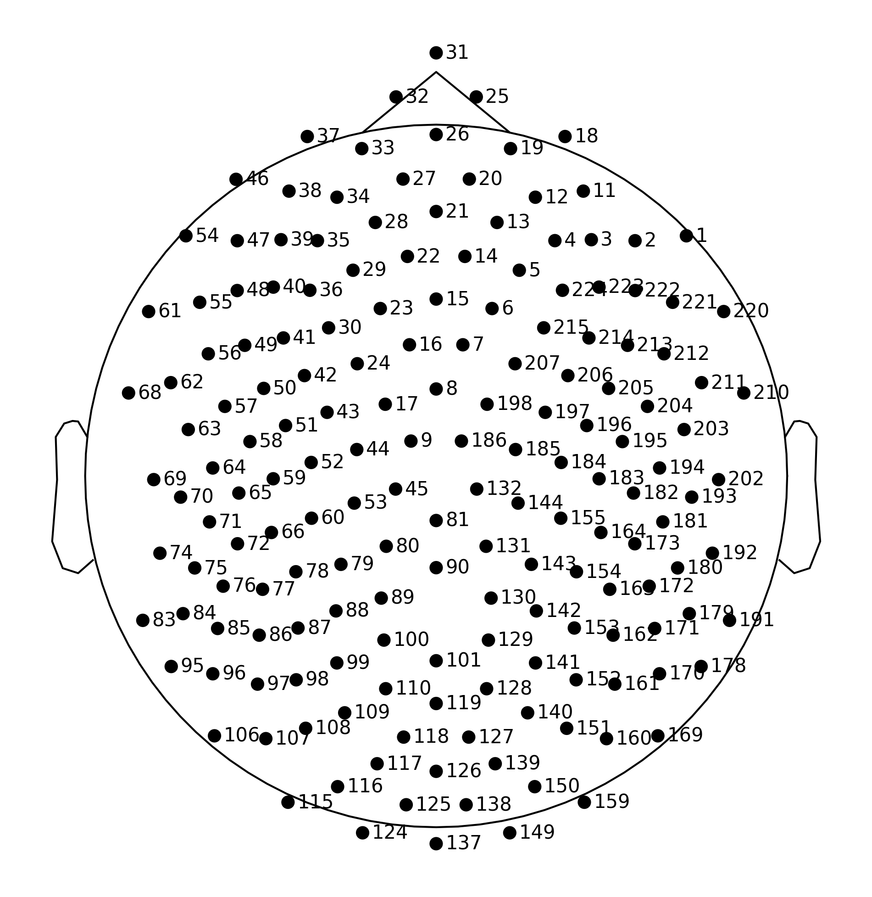
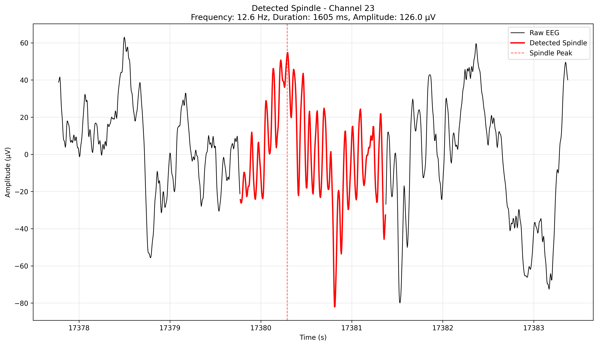
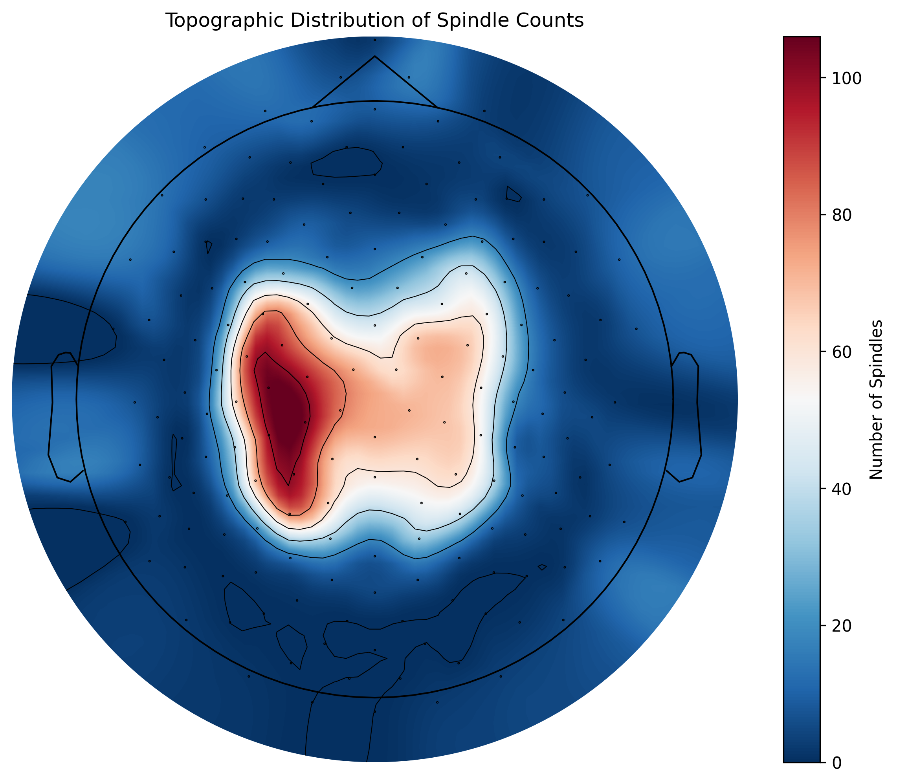
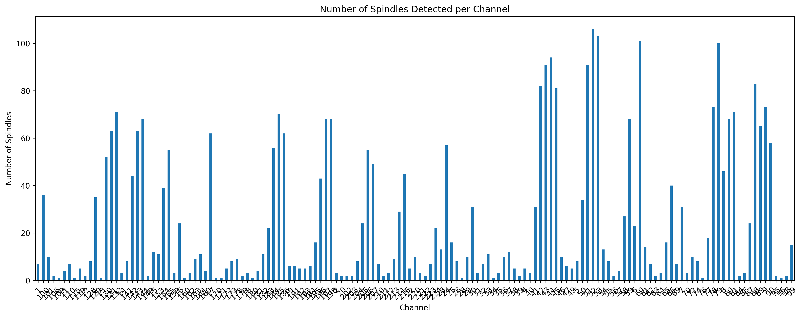
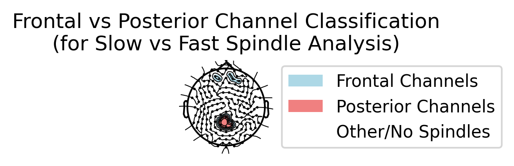
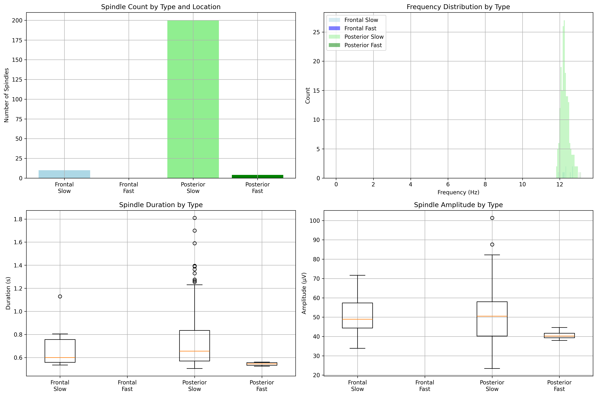
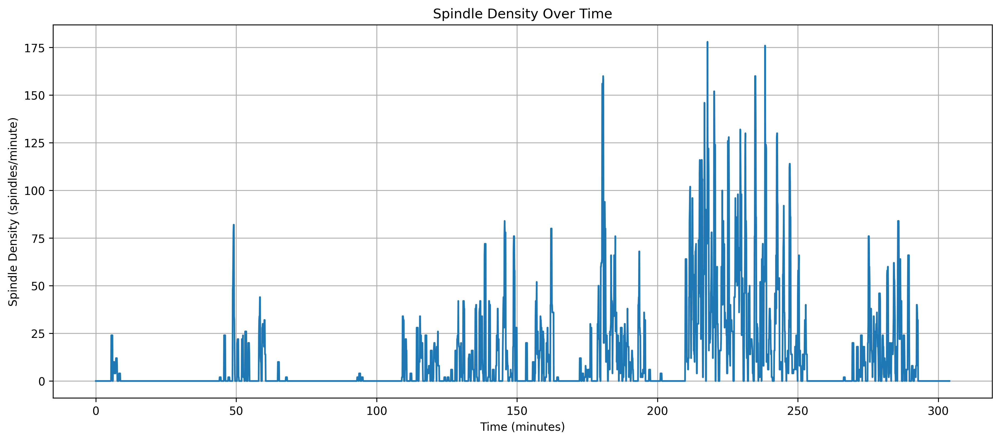

# Sleep Spindle Analysis Report
*Date: June 25, 2024*

## Dataset Information
- **File**: `008_Resampled_sleep_zapline_N2N3_clean.set`
- **Format**: EEGLAB (.set)
- **Recording Duration**: 304.56 minutes
- **Sampling Rate**: 200 Hz
- **Number of Channels**: 172

## Processing Steps

### 1. Data Loading and Preprocessing
- Loaded EEG data using MNE-Python
- Converted signal units to microvolts (μV)
- Verified channel information and data dimensions

### 2. Channel Layout
The EEG recording used a high-density montage with 172 channels. The sensor layout is shown below:

### 3. Spindle Detection
Spindle detection was performed using the YASA (Yet Another Spindle Algorithm) package with the following steps:
- Multi-channel spindle detection across all electrodes
- Detection parameters:
  - Frequency range: 11-16 Hz (sigma band)
  - Minimum duration: 0.5 seconds
  - Maximum duration: 2.0 seconds

### 4. Results

#### 4.1.1 Individual Spindle Visualization

*Figure: Example of a detected spindle overlaid on raw EEG signal. The red portion shows the exact detected spindle segment, with a dashed vertical line marking the spindle peak.*

#### 4.2 Spatial Distribution

*Figure: Topographic distribution of spindle counts across the scalp*

*Figure: Number of spindles detected per channel*

#### 4.3 Slow vs Fast Spindle Analysis

Based on anatomical channel definitions:
- **Frontal channels**: 20, 27, 34, 21, 28, 13, 4 (channels with detected spindles: 20, 34, 28, 13, 4)
- **Posterior channels**: 101, 100, 129, 89, 90 (all channels had detected spindles)
- **Frequency classification**: Slow spindles (11-13 Hz), Fast spindles (13-16 Hz)

*Figure: Channel classification for regional analysis. Blue channels represent frontal regions, coral channels represent posterior regions.*

*Figure: Comparison of slow (11-13 Hz) vs fast (13-16 Hz) spindles across frontal and posterior regions. Shows: A) Spindle counts by type and location, B) Frequency distributions, C) Duration comparisons, D) Amplitude comparisons.*

##### Regional Spindle Statistics:
- **Frontal Slow Spindles**: 10 spindles (mean frequency: 12.32 Hz)
- **Frontal Fast Spindles**: 0 spindles
- **Posterior Slow Spindles**: 200 spindles (mean frequency: 12.28 Hz)
- **Posterior Fast Spindles**: 4 spindles (mean frequency: 13.08 Hz)

**Key Findings**:
- Posterior regions showed significantly more spindle activity than frontal regions (204 vs 10 total spindles)
- The majority of spindles fell within the slow frequency range (11-13 Hz)
- Fast spindles (13-16 Hz) were rare and occurred almost exclusively in posterior regions
- This distribution suggests posterior-dominant spindle generation, consistent with sleep spindle literature

#### 4.4 Temporal Distribution

*Figure: Spindle density throughout the recording period*

## Summary Statistics

### Temporal Statistics
- Average spindle density: 11.60 spindles/minute
- Peak spindle density: 178.00 spindles/minute
- Total recording duration: 304.56 minutes

### Spindle Characteristics
- Total spindles detected: 3,526
- Mean spindle duration: 0.763 ± 0.155 seconds
- Mean spindle amplitude: 52.493 ± 15.321 μV
- Mean spindle frequency: 12.285 ± 0.452 Hz

## Data Files
All analysis outputs have been saved in the following formats:

### Images (PNG, 300 DPI)
All images are stored in `assets/June_25/`:
- `sensor_layout_2d.png`: EEG channel layout
- `spindles_per_channel_barplot.png`: Bar plot of spindle counts
- `spindle_characteristics.png`: Comprehensive spindle characteristics overview
- `best_spindle_detail.png`: Detailed view of highest amplitude spindle
- `spindle_overlay.png`: Individual spindle visualization on raw EEG
- `spindle_topographic_distribution.png`: Topographic distribution
- `frontal_posterior_regions.png`: Channel classification for regional analysis
- `spindle_types_comparison.png`: Slow vs fast spindle comparison
- `spindle_density_over_time.png`: Time series of spindle density

### Data Files
Located in `assets/June_25/`:
- `spindles_per_channel_summary.csv`: Channel-wise statistics
- `spindle_density_over_time.csv`: Temporal density data
- `all_spindles_detailed.csv`: Individual spindle characteristics
- `spindle_topographic_data.npy`: Topographic distribution data

### Text Reports
Located in `assets/June_25/`:
- `channel_statistics.txt`: Channel-wise statistical summary
- `spindle_analysis_summary.txt`: Comprehensive analysis summary

## Notes
- Some channels showed no spindle activity, which is expected in high-density EEG recordings
- The temporal distribution shows varying spindle density throughout the recording
- The topographic distribution reveals areas of higher spindle activity, particularly in central regions

---
*Analysis performed using Python with MNE, YASA, and scientific computing libraries* 

--- 
References  

https://pmc.ncbi.nlm.nih.gov/articles/PMC3543056/
